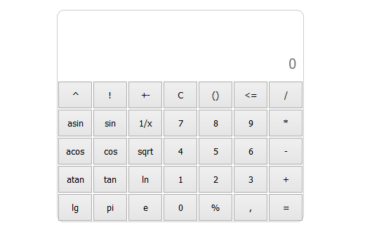

## Calculator
React-based engineering calculator.

Supported features:
- [ ] Radians-degrees conversion.
- [x] Trigonometric operations.
- [x] Floating point numbers.
- [x] Logarithmic operations.
- [x] Basic math operations.
- [x] Inversion operation.
- [x] Percent operation.
- [ ] Exponent.
- [x] Factorial.
- [x] Pi.

 