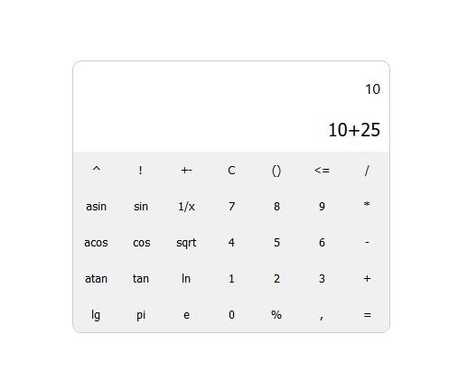

## Calculator
React-based engineering calculator.

Supported features:
- [ ] Radians-degrees conversion.
- [x] Trigonometric operations.
- [x] Logarithmic operations.
- [x] Basic math operations.
- [ ] Percent operation.
- [ ] Exponent.
- [ ] Factorial.
- [x] Pi.

 